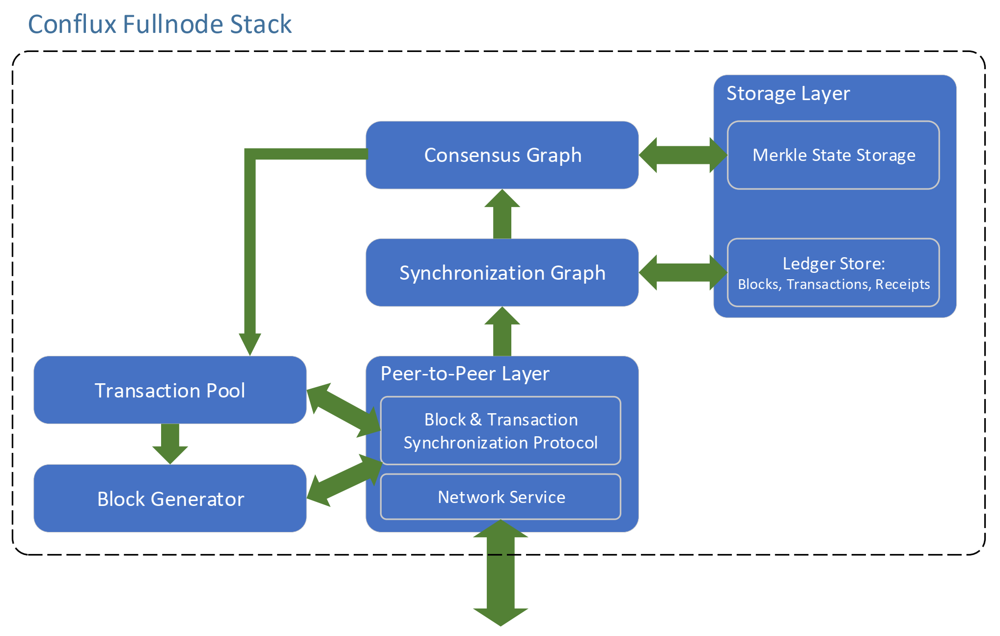

# Conflux Design Document
In this document, we describe the architecture and organization of Conflux software stack and its design rationale.
The following figure shows the overview of the Conflux full node stack.

It consists of several key components.

* Peer-to-Peer Layer
* Synchronization Graph
* Consensus Graph
* Storage Layer
* Transaction Pool
* Block Generator

Generally speaking, the peer-to-peer layer takes charge of disseminating blocks and transactions among the nodes in the entire network where each node maintains several inbound/outbound connections to its peers. 
Each node also maintains an in-memory synchronization graph data structure. When a new block is received from a peer or generated locally, the block will be first inserted into the synchronization graph where it goes through some basic validation which does not require graph-wise information. 
At the time when a block enters the synchronization graph, its past-set blocks may not already entered.
The synchronization graph monitors the block and puts it into the consensus graph once all its past-set blocks enters the synchronization graph. 
When a block enters the consensus graph, its past-set blocks should all already entered this graph. 
Then the consensus algorithm will be conducted based on this newly arrived block to adjust the total order of blocks accordingly. The consensus graph component executes the newly arrived block and updates the account states in the storage layer. 

Each node maintains a transaction pool that holds the to-be-packed transactions and relays the transactions to its peers that may need them. 
The block generator component drives the mining efforts, picks transactions from the pool, and packs them into the newly generated block.

This document is organized as in the following sections.

* [Consensus Mechanism](consensus.md)
* [Block Synchronization Process](sync.md)
* [Transaction Relay](trans.md)

