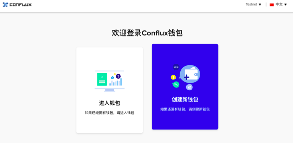
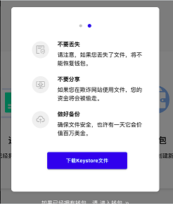
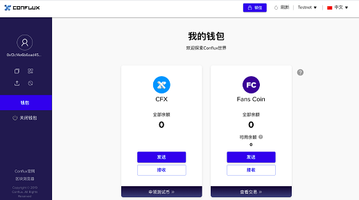

创建Conflux的web钱包
===

访问web地址:  **wallet.confluxscan.io**
创建新的钱包 or 进入钱包.

* 创建新的钱包: 设置钱包密码, 下载'Keystore'文件, 并设置钱包密码。
* 进入钱包: 需要上传创建时下载回来的'Keystore'文件, 输入钱包密码。

创建新的钱包，时请务必仔细阅读页面中的文字，务必注意保管'Keystore'文件

如果您丢失了'Keystore'文件，将不能恢复钱包。

