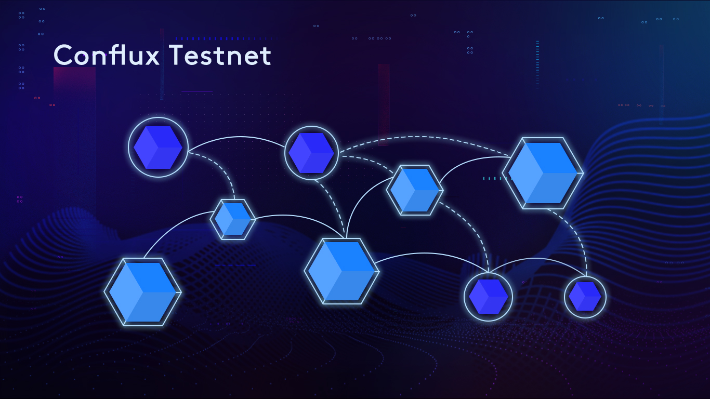

# Welcome to Conflux

**The Conflux Testnet is Live!**

We are excited to annouce the Conflux testnet release to provide developers and users the early access to our technology.

[Conflux](https://www.conflux-chain.org/) is a next generation pow-based public blockchain system which can achieve throughput with thousands of transactions per second and transaction confirmation latency in minutes. The key that enables its such high performance is its novel consensus mechanism based on the **Tree-Graph (TG)** blockchain structure. 

In this testnet release, the main features include:

- The Tree-Graph based consensus mechanism
- The account state store with Merkle-Tree based authentication
- The Javascript and JsonRpc API for fullnode interaction
- Solidity compatible smart contract  
- ConfluxScan - the block chain explorer
- A web-based Conflux wallet
